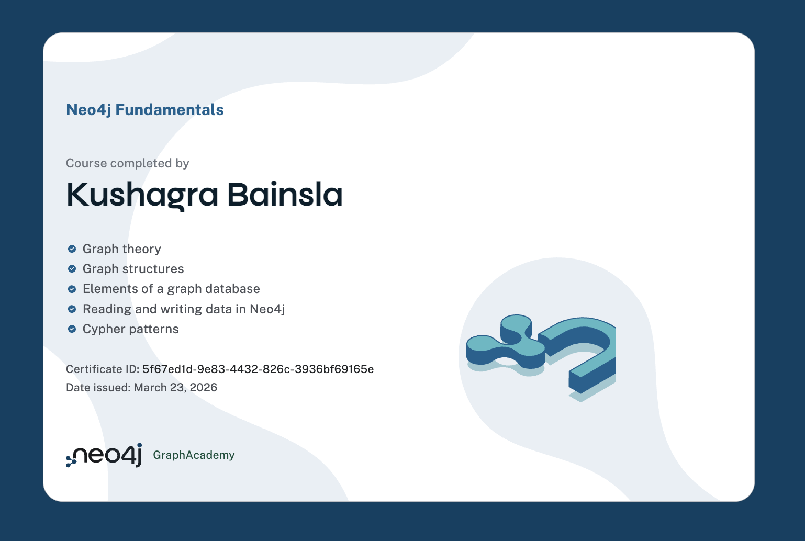
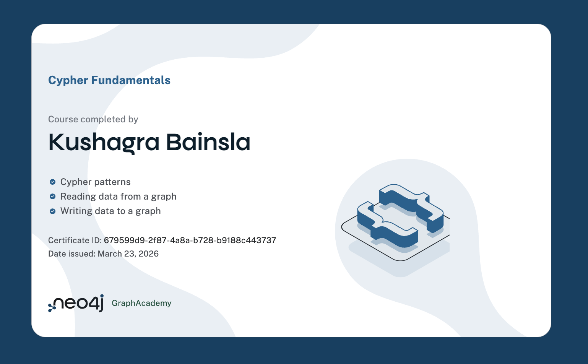
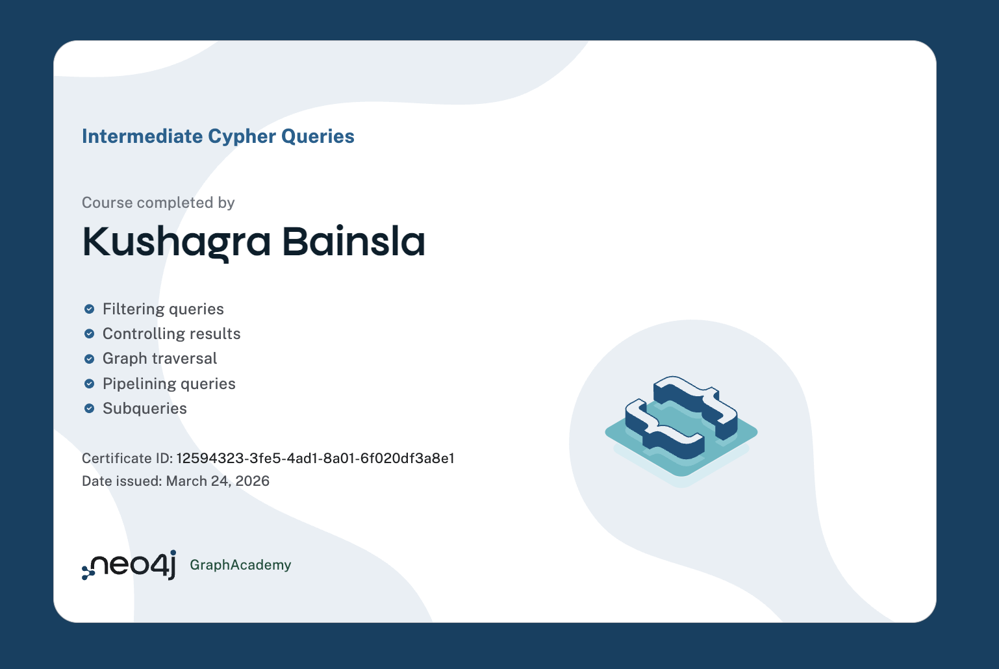
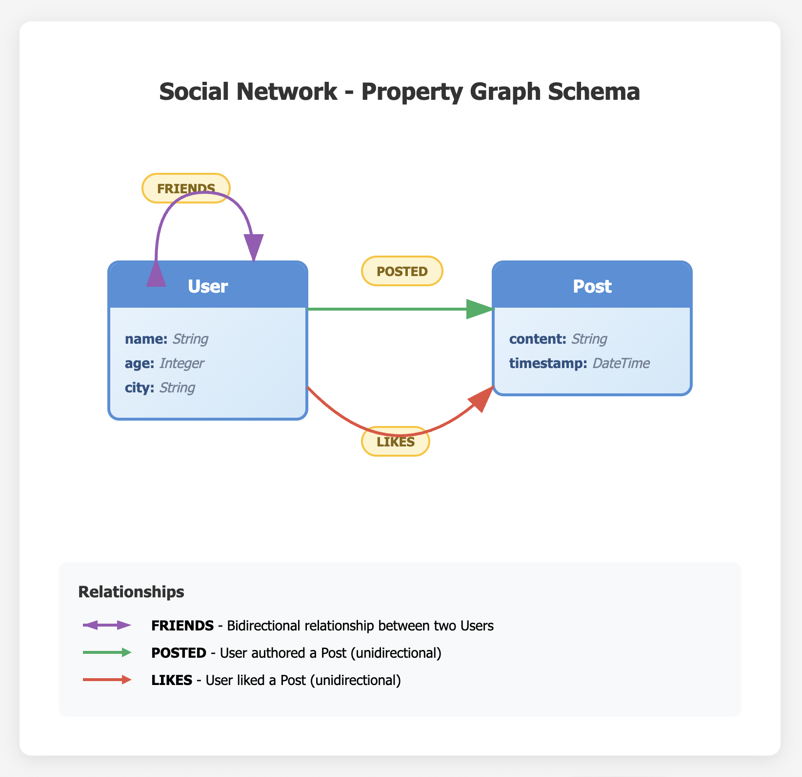
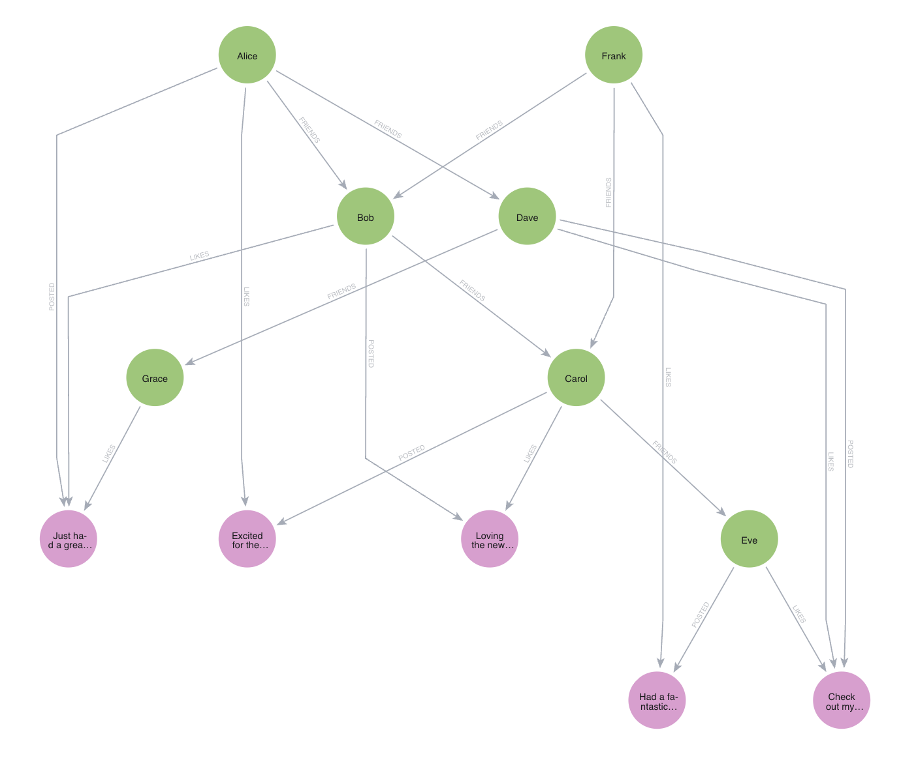

# Individual Tasks - Neo4j Assignment

**Name:** Kushagra Bainsla
**Date:** March 24, 2026

---

## Task 1: Neo4j Graph Academy Courses (44 points)

### Certificate Screenshots

#### Neo4j Fundamentals (10 points)


#### Cypher Fundamentals (10 points)


#### Intermediate Cypher Queries (24 points)


---

## Task 2: Graph Data Model Design (2 points)

### Property Graph Schema for Social Network



**Nodes:**
- **User** - Represents a person in the network
  - Properties: `name` (String), `age` (Integer), `city` (String)
- **Post** - Represents a status update made by a user
  - Properties: `content` (String), `timestamp` (DateTime)

**Relationships:**
- **FRIENDS** - Connects two User nodes (bidirectional), representing friendship
- **POSTED** - Connects a User to a Post (unidirectional), indicating authorship
- **LIKES** - Connects a User to a Post (unidirectional), representing a like action

---

## Task 3: Creating the Graph in Neo4j (2 points)

### Cypher Command to Create the Graph

```cypher
CREATE (alice:User {name: 'Alice', age: 30, city: 'San Francisco'}),
       (bob:User {name: 'Bob', age: 28, city: 'San Francisco'}),
       (carol:User {name: 'Carol', age: 25, city: 'Los Angeles'}),
       (dave:User {name: 'Dave', age: 35, city: 'San Francisco'}),
       (eve:User {name: 'Eve', age: 27, city: 'Los Angeles'}),
       (frank:User {name: 'Frank', age: 32, city: 'New York'}),
       (grace:User {name: 'Grace', age: 29, city: 'San Francisco'}),
       (post1:Post {content: 'Just had a great coffee!', timestamp: '2024-10-20T10:00:00'}),
       (post2:Post {content: 'Loving the new park in town!', timestamp: '2024-10-21T11:30:00'}),
       (post3:Post {content: 'Excited for the weekend!', timestamp: '2024-10-22T12:00:00'}),
       (post4:Post {content: 'Check out my new recipe!', timestamp: '2024-10-23T09:00:00'}),
       (post5:Post {content: 'Had a fantastic workout!', timestamp: '2024-10-24T08:00:00'}),
       (alice)-[:FRIENDS]->(bob),
       (alice)-[:FRIENDS]->(dave),
       (bob)-[:FRIENDS]->(carol),
       (carol)-[:FRIENDS]->(eve),
       (dave)-[:FRIENDS]->(grace),
       (frank)-[:FRIENDS]->(bob),
       (frank)-[:FRIENDS]->(carol),
       (alice)-[:POSTED]->(post1),
       (bob)-[:POSTED]->(post2),
       (carol)-[:POSTED]->(post3),
       (dave)-[:POSTED]->(post4),
       (eve)-[:POSTED]->(post5),
       (bob)-[:LIKES]->(post1),
       (grace)-[:LIKES]->(post1),
       (carol)-[:LIKES]->(post2),
       (alice)-[:LIKES]->(post3),
       (eve)-[:LIKES]->(post4),
       (dave)-[:LIKES]->(post4),
       (frank)-[:LIKES]->(post5)
```

### Graph Visualization



---

## Task 4: Cypher Queries (19 points)

### Basic Level (5 points)

#### Q1. List all users and their posts (1 point)

**Query:**
```cypher
MATCH (u:User)-[:POSTED]->(p:Post)
RETURN u.name AS User, p.content AS Post
```

**Result:**
| User  | Post                          |
|-------|-------------------------------|
| Alice | Just had a great coffee!      |
| Bob   | Loving the new park in town!  |
| Carol | Excited for the weekend!      |
| Dave  | Check out my new recipe!      |
| Eve   | Had a fantastic workout!      |

---

#### Q2. Find all friends of 'Alice' (1 point)

**Query:**
```cypher
MATCH (alice:User {name: 'Alice'})-[:FRIENDS]-(friend:User)
RETURN friend.name AS Friend
```

**Result:**
| Friend |
|--------|
| Bob    |
| Dave   |

---

#### Q3. Find all posts liked by 'Bob' (1 point)

**Query:**
```cypher
MATCH (bob:User {name: 'Bob'})-[:LIKES]->(post:Post)
RETURN post.content AS LikedPost
```

**Result:**
| LikedPost                |
|--------------------------|
| Just had a great coffee! |

---

#### Q4. Find users who like each other's posts (mutual likers) (1 point)

**Query:**
```cypher
MATCH (u1:User)-[:POSTED]->(p1:Post)<-[:LIKES]-(u2:User),
      (u2)-[:POSTED]->(p2:Post)<-[:LIKES]-(u1)
WHERE u1 <> u2
RETURN DISTINCT u1.name AS User1, u2.name AS User2
```

**Result:**
```
(no changes, no records)
```

*Note: In this dataset, there are no users who mutually like each other's posts. For example, Alice likes Carol's post, but Carol does not like Alice's post.*

---

#### Q5. Find the most liked post (1 point)

**Query:**
```cypher
MATCH (p:Post)<-[:LIKES]-(u:User)
RETURN p.content AS Post, COUNT(u) AS LikeCount
ORDER BY LikeCount DESC
LIMIT 1
```

**Result:**
| Post                     | LikeCount |
|--------------------------|-----------|
| Just had a great coffee! | 2         |

---

### Intermediate Level (12 points)

#### Q6. Find mutual friends between 'Alice' and 'Bob' (2 points)

**Query:**
```cypher
MATCH (alice:User {name: 'Alice'})-[:FRIENDS]-(mutualFriend:User)-[:FRIENDS]-(bob:User {name: 'Bob'})
WHERE alice <> bob
RETURN DISTINCT mutualFriend.name AS MutualFriend
```

**Result:**
```
(no changes, no records)
```

*Note: Alice and Bob are direct friends but share no mutual friends. Alice's friends are Bob and Dave. Bob's friends are Alice, Carol, and Frank. None overlap.*

---

#### Q7. Get Users who liked Alice's Posts (2 points)

**Query:**
```cypher
MATCH (alice:User {name: 'Alice'})-[:POSTED]->(post:Post)<-[:LIKES]-(liker:User)
RETURN DISTINCT liker.name AS UserWhoLikedAlicePost
```

**Result:**
| UserWhoLikedAlicePost |
|-----------------------|
| Bob                   |
| Grace                 |

---

#### Q8. Count the number of likes for each post made by 'Alice' (2 points)

**Query:**
```cypher
MATCH (alice:User {name: 'Alice'})-[:POSTED]->(post:Post)
OPTIONAL MATCH (post)<-[:LIKES]-(liker:User)
RETURN post.content AS Post, COUNT(liker) AS LikeCount
```

**Result:**
| Post                     | LikeCount |
|--------------------------|-----------|
| Just had a great coffee! | 2         |

---

#### Q9. Find the top three users who have posted the most updates (2 points)

**Query:**
```cypher
MATCH (u:User)-[:POSTED]->(p:Post)
RETURN u.name AS User, COUNT(p) AS PostCount
ORDER BY PostCount DESC
LIMIT 3
```

**Result:**
| User  | PostCount |
|-------|-----------|
| Alice | 1         |
| Bob   | 1         |
| Carol | 1         |

*Note: All users have exactly 1 post each in this dataset.*

---

#### Q10. Retrieve all posts that friends of 'Alice' liked (2 points)

**Query:**
```cypher
MATCH (alice:User {name: 'Alice'})-[:FRIENDS]-(friend:User)-[:LIKES]->(post:Post)
RETURN DISTINCT friend.name AS Friend, post.content AS LikedPost
```

**Result:**
| Friend | LikedPost                   |
|--------|-----------------------------|
| Bob    | Just had a great coffee!    |
| Dave   | Check out my new recipe!    |

---

#### Q11. Find users in 'San Francisco' who have the most friends (2 points)

**Query:**
```cypher
MATCH (u:User {city: 'San Francisco'})-[:FRIENDS]-(friend:User)
RETURN u.name AS User, COUNT(DISTINCT friend) AS FriendCount
ORDER BY FriendCount DESC
```

**Result:**
| User  | FriendCount |
|-------|-------------|
| Bob   | 3           |
| Alice | 2           |
| Dave  | 2           |
| Grace | 1           |

---

### Update/Delete (2 points)

#### Q12. Update Alice's City to 'Los Angeles' (1 point)

**Query:**
```cypher
MATCH (alice:User {name: 'Alice'})
SET alice.city = 'Los Angeles'
RETURN alice.name AS User, alice.city AS NewCity
```

**Result:**
| User  | NewCity     |
|-------|-------------|
| Alice | Los Angeles |

---

#### Q13. Delete a post with content 'Hello World!' (1 point)

**Query:**
```cypher
MATCH (p:Post {content: 'Hello World!'})
DETACH DELETE p
```

**Result:**
```
(no changes, no records)
```

*Note: No post with content 'Hello World!' exists in the dataset, so the query executes successfully but deletes nothing.*

---

## Task 5: Explanations (3 points)

### How Graph Databases Differ from Relational Databases (1.5 points)

Graph databases and relational databases represent fundamentally different approaches to data storage and retrieval. Relational databases organize data into structured tables with rows and columns, where relationships between entities are established through foreign keys and require JOIN operations to traverse connections. This model excels at handling structured, tabular data but becomes increasingly inefficient when dealing with highly connected data requiring multiple JOIN operations.

Graph databases, in contrast, store data as nodes (entities) and edges (relationships), making connections first-class citizens of the data model. Each node contains properties and maintains direct pointers to its adjacent nodes, eliminating the need for expensive JOIN operations. This native representation of relationships allows graph databases to traverse connections in constant time, regardless of the total dataset size.

The key differences include: (1) **Query Performance** - Graph databases maintain constant-time traversal performance for relationship queries, while relational databases suffer exponential degradation with each additional JOIN; (2) **Schema Flexibility** - Graph databases offer more flexible schemas, easily accommodating new node types and relationship patterns without major restructuring; (3) **Data Modeling** - Graph models more naturally represent real-world scenarios involving networks, hierarchies, and interconnected entities; (4) **Use Cases** - Relational databases suit transactional systems with well-defined schemas, while graph databases excel at social networks, recommendation engines, fraud detection, and knowledge graphs where relationship traversal is paramount.

---

### Explain "Index Free Adjacency" (1.5 points)

Index Free Adjacency is a fundamental property of native graph databases where each node directly stores physical pointers (memory addresses) to its adjacent nodes, rather than using global indexes to locate connected nodes. This means that when traversing from one node to another through a relationship, the database can follow these direct references in constant O(1) time, without needing to perform index lookups. This architectural design makes graph traversals extremely efficient because the cost of traversing a relationship remains constant regardless of the overall graph size, enabling graph databases to handle complex, multi-hop queries across billions of nodes with consistent performance.
